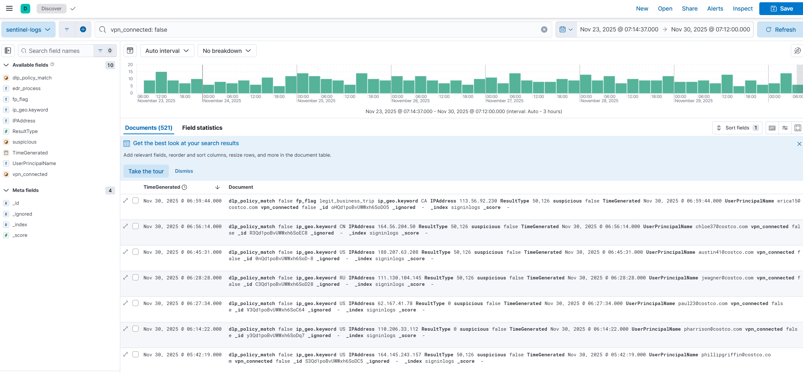
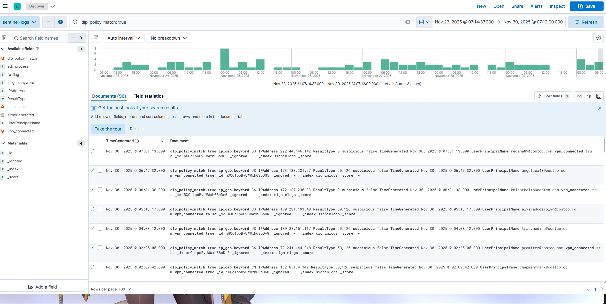
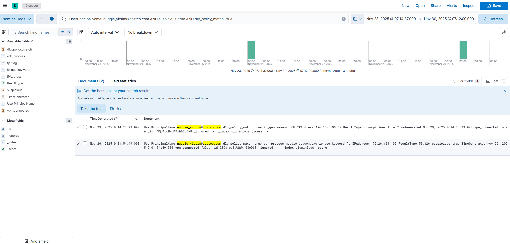

# ThreatHunt-CostcoNuggies-Sim
End-to-End Threat Detection Sim: Hunt CostcoNuggies APT (VPN Phishing → Exfil), Build/Tune Rules, Automate w/ SIEM/SOAR. Open-source SOC-in-a-box for polyvalent engineering.

## Metrics Dashboard (Kibana Viz)
Interactive hunts and metrics from the notebook (localhost:5601 > Discover > signinlogs*).

  
*H1 Hunt: Bypass events grouped by ip_geo (CA FPs 22, RU threats 37)—shows sweet spot for geo-tuned rules (V2 precision 0.95 from Step 5).*

  
*H2 Hunt: DLP matches by user (nuggie_victim burst 1)—highlights insider exfil signals for threshold alerts (>1/user, tuned to 85 alerts in Step 5.3).*

  
*H3 Hunt: Victim chain table (nuggie_victim + suspicious + DLP + RU = 1 hit)—escalation sequence (timestamp RU geo, True DLP/suspicious), triggers EDR isolate in SOAR mock (MTTR <1 min from Step 6).*